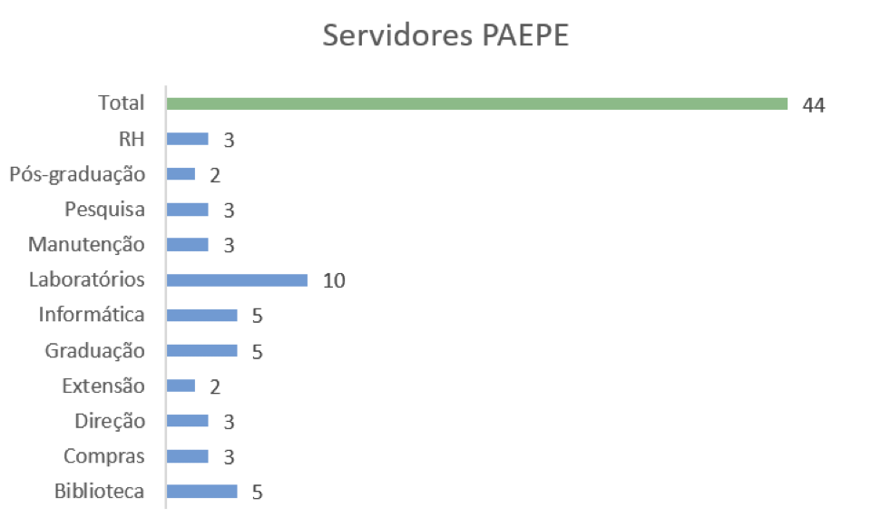
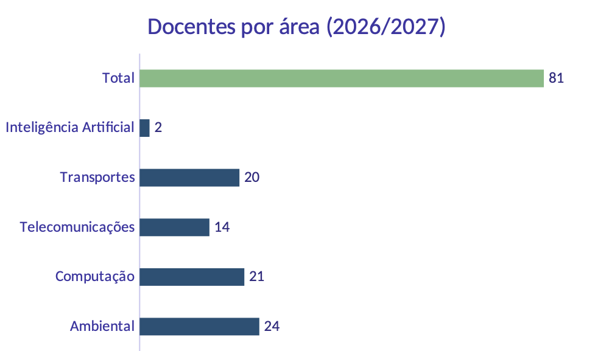
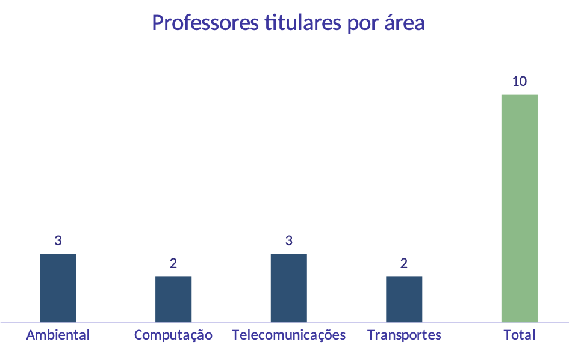

O fortalecimento institucional da FT depende do aperfeiçoamento contínuo de seus instrumentos de gestão, da valorização das pessoas e da consolidação de processos administrativos cada vez mais claros, eficientes e transparentes. Para isso, é fundamental promover uma gestão participativa, capaz de envolver a comunidade acadêmica na construção e no aprimoramento das normas, procedimentos e práticas institucionais, assegurando que esses instrumentos acompanhem a evolução da Unidade e respondam às demandas atuais e futuras.

## Regimento Interno, Certificação e Fluxos de Trabalho

No âmbito da gestão administrativa, é necessário revisar e aprimorar os fluxos de trabalho, buscando simplificar procedimentos, reduzir retrabalho, aumentar a eficiência operacional e ampliar a previsibilidade e a transparência das rotinas institucionais. Esse processo será conduzido de forma colaborativa, valorizando a experiência dos servidores e estimulando a construção coletiva de soluções.

Nesse contexto, propomos retomar a discussão do Regimento Interno da FT, articulada à revisão da Certificação, de modo a atualizar esses instrumentos em consonância com a realidade institucional e com as perspectivas de crescimento da unidade. Ademais, precisamos modernizar nossa certificação, melhorando os fluxos de processos nas seções, inclusive dando maior autonomia para cada uma delas. 

Como ferramenta de apoio à melhoria contínua, incentivaremos o mapeamento e o acompanhamento sistemático dos processos administrativos. Também buscaremos ampliar o uso de ferramentas de gestão, automação e inteligência artificial que possam facilitar o planejamento, o acompanhamento das demandas e a execução de atividades operacionais e rotineiras.

Essas iniciativas permitirão identificar oportunidades de aperfeiçoamento, padronizar procedimentos, qualificar a gestão da informação e orientar ações de capacitação específicas para cada área. O uso dessas ferramentas deverá ocorrer de forma responsável, com supervisão humana e em conformidade com as normas institucionais, contribuindo para otimizar os recursos disponíveis e ampliar a qualidade dos serviços oferecidos à comunidade acadêmica.

Entendemos que uma gestão moderna exige não apenas processos eficientes, mas também um ambiente de trabalho baseado no respeito, na cooperação, no reconhecimento e no desenvolvimento das pessoas. Por isso, buscaremos fortalecer uma cultura organizacional pautada pelo diálogo, pela participação, pela inovação e pelo compromisso com a excelência acadêmica e administrativa, criando condições para que docentes, servidores técnico-administrativos e estudantes contribuam de forma ativa para o desenvolvimento da Faculdade de Tecnologia.

## Quadro de Servidores Técnico-Administrativos e Docentes

Entre 2023 e 2026, conseguimos quatro novos cargos PAEPE, com muito empenho por parte da direção. Hoje nosso quadro PAEPE conta com 44 servidores (@fig-paepe), divididos entre as seções administrativas, biblioteca e atendimento aos laboratórios. Nesse quadro, temos 1 servidor afastado e 1 aguardando transferência para a FT, e ainda, servidores que nos próximos anos entrarão com pedido de aposentadoria.

::: {.centerText}
{#fig-paepe width=80%}
:::

Além da necessidade de mapear de forma sistemática as atividades das seções, para demandas e dimensionar adequadamente as equipes, é fundamental buscar novos cargos para servidores técnico-administrativos. Há demandas específicas, especialmente nas áreas de telecomunicações e computação, para atender às aulas práticas de graduação, aos serviços de Tecnologia da Informação e Comunicação (TIC) e ao suporte a docentes e pesquisadores em seus projetos.

Já conhecemos os caminhos institucionais e sabemos o que precisa ser feito. Nosso compromisso para o próximo quadriênio é atuar junto à Universidade na busca por novos cargos, priorizando as áreas em que há demandas ainda não atendidas e garantindo as condições necessárias para o desenvolvimento das atividades-fim da FT.

Em relação ao Quadro de Docentes (QD), tivemos diversas aposentadorias nos últimos anos, que não foram repostas. Ocorreram distribuições de novos cargos docentes para as faculdades e institutos, e a FT sempre foi bastante ativa nas discussões, ficando entre as unidades que se destacaram número de cargos concedidos (carreira MS).

Atualmente, temos **78 docentes ativos**, e se considerarmos três contratações em andamento (1 para a área ambiental e 2 para o curso de inteligência artificial), teremos no início de 2026, 81 docentes (@fig-docente). Temos ainda, três cargos que estão aguardando abertura de concurso, que não foram contabilizados. 

::: {.centerText}
{#fig-docente width=80%}
:::

Também tivemos, na atual gestão, um aumento expressivo no número de professores titulares. Foram realizados sete concursos, encerrando 2026 com uma distribuição mais equilibrada de professores titulares entre as diferentes áreas da FT (@fig-titulares).

::: {.centerText}
{#fig-titulares width=80%}
:::

É importante destacar que, atualmente, não há vagas disponíveis para professor titular na Unidade. Esse cenário, por outro lado, abre uma perspectiva importante para o próximo quadriênio: na próxima distribuição de vagas pela Universidade, a FT deverá ter condições de pleitear novas vagas e cargos de professor titular, possibilitando a continuidade da renovação e do fortalecimento do quadro docente.

Ainda em relação ao QD, cabem algumas considerações importantes. Primeiro, buscaremos a **reposição de vagas** decorrentes das aposentadorias ocorridas nos últimos anos, bem como novas vagas e cargos docentes. Essa recomposição é fundamental para promover um melhor equilíbrio na distribuição da carga didática entre a graduação e a pós-graduação e, ao mesmo tempo, assegurar aos docentes melhores condições para o desenvolvimento das atividades de pesquisa, extensão e demais atividades acadêmicas.

Uma segunda consideração diz respeito à necessidade de estabelecermos **critérios transparentes para a contratação de docentes**. A distribuição das vagas deverá considerar, entre outros aspectos, a oferta de disciplinas nos cursos de graduação, incluindo as disciplinas de serviço; a distribuição da carga didática dos docentes entre graduação e pós-graduação; o número de cursos atendidos por cada área; o número de estudantes envolvidos nas disciplinas; e as demandas decorrentes da expansão ou criação de novos cursos e áreas de atuação.

Por fim, entendemos ser necessária a **atenção às carreiras docentes** da FT. Atualmente, nossa Unidade conta com duas carreiras: o Magistério Superior (MS) e o Magistério Tecnológico Superior (MTS) (@fig-mts). 

::: {.centerText}
![Número de docentes nas carreiras MTS e MS na FT, por nível[^3].](figs/mts-ms.png){#fig-mts width=80%}
:::

[^3]: Dados obtidos do painel de dados para apoio à tomada de decisão do Escritório de Dados e Apoio à Transformação (Edat).
Disponível em: [https://www.dados.unicamp.br/produto/apoio-a-tomada-de-decisoes-painel-de-dados/](https://www.dados.unicamp.br/produto/apoio-a-tomada-de-decisoes-painel-de-dados/).

Desde a transformação do CESET em FT, em 2009, as novas contratações passaram a ser realizadas exclusivamente na carreira MS, o que explica a diferença significativa no número de docentes entre as duas carreiras. É fundamental, entretanto, valorizar e reconhecer a contribuição de ambas as carreiras para a construção e   da identidade acadêmica da FT.

Consideramos, entretanto, **fundamental valorizar e reconhecer a contribuição de ambas as carreiras para a construção da identidade acadêmica da FT**, respeitando suas especificidades e assegurando condições para que todos os docentes possam desenvolver plenamente suas atividades de ensino, pesquisa e extensão.

A carreira MTS foi criada pela Deliberação CONSU-A-001/1992 e alterada, em 2001, pela Deliberação CONSU-A-010/2001. Sua estrutura permanece, portanto, praticamente inalterada há mais de duas décadas. Atualmente, encontra-se em tramitação na Universidade uma proposta de atualização das carreiras especiais, incluindo a carreira MTS. A proposta está em análise pela Procuradoria Geral (PG) e, até o momento, não entrou em discussão na CIDD.

Nesse contexto, **a FT deve assumir uma posição ativa na defesa e na atualização da carreira MTS**, reconhecendo sua importância histórica e sua contribuição para a formação tecnológica e para a consolidação das atividades de ensino, pesquisa e extensão. Iremos, portanto, apoiar e participar ativamente da tramitação da proposta, buscando reduzir assimetrias em relação à carreira MS, assegurar condições adequadas para o desenvolvimento integrado das atividades acadêmicas e valorizar a especificidade da formação e da atuação tecnológica. De forma específica, entendemos que a Direção da FT deve:

- acompanhar e participar das discussões sobre a tramitação da proposta da carreira MTS junto à Reitoria, CIDD, CEPE e CONSU;

-  manter diálogo permanente com os docentes da carreira, assegurando sua participação nas discussões e decisões que lhes dizem respeito;

-  defender a atualização da carreira, de modo a torná-la compatível com as atuais atividades de ensino, pesquisa e extensão desenvolvidas na FT;

-  defender a inclusão dos docentes MTS nos programas institucionais de apoio à pesquisa, extensão, inovação e internacionalização; e

-  fortalecer a representação das carreiras especiais nos espaços de discussão e decisão da Universidade.

Cabe destacar, ainda, que a UNICAMP dispõe atualmente de 20 cargos MTS no Quadro Permanente, dos quais 12 estão ocupados por docentes ativos. Há, portanto, cargos disponíveis que podem ser utilizados para novas contratações, contribuindo para a reposição das aposentadorias ocorridas nos últimos anos e para a manutenção e o fortalecimento da carreira MTS na FT.

## Valorização e Desenvolvimento da Carreira PAEPE

A valorização e o desenvolvimento da carreira PAEPE serão princípios permanentes da gestão. No âmbito dos servidores técnico-administrativos, ampliaremos as ações de orientação sobre a carreira, tornando mais acessíveis as informações sobre processos de progressão, desenvolvimento profissional e oportunidades de capacitação. Iremos fortalecer a política de formação continuada, estruturando trilhas de desenvolvimento alinhadas às competências e às necessidades das seções, com vistas a contribuir tanto para a qualificação dos serviços quanto para o crescimento profissional das equipes.

Para isso, será fundamental manter e ampliar a parceria com a Educorp, promovendo cursos de atualização e aperfeiçoamento voltados às necessidades dos profissionais da FT. As ações de formação serão planejadas a partir das demandas identificadas junto à comunidade e contemplarão o desenvolvimento de competências técnicas, administrativas e de gestão.

Outro aspecto que julgamos importante para a carreira PAEPE, é o fortalecimento da autonomia dos servidores na organização e na execução dos Processos de Carreira, do Prêmio PAEPE e de outras iniciativas voltadas ao desenvolvimento e à valorização profissional. A gestão oferecerá o apoio institucional necessário, respeitando o protagonismo dos servidores na condução dessas ações.

Estamos neste exato momento discutindo a implantação do **trabalho híbrido** na FT, uma conquista recente e institucional importante, e que representa uma nova possibilidade de organização das atividades dos servidores PAEPE. Buscaremos ampliar o acesso a essa modalidade aos servidores elegíveis, com respeito às normas da Universidade e sem comprometer a continuidade, a qualidade e a regularidade do atendimento à comunidade acadêmica. Será realizada uma análise objetiva das funções, das atividades e das lotações da unidade, evitando restrições genéricas ou baseadas apenas em interpretações subjetivas. A definição da elegibilidade deverá considerar a possibilidade de execução das atividades a distância, sua mensuração e seu acompanhamento por meio de planos de entregas, bem como a necessidade efetiva de atendimento presencial.

Também buscaremos orientação detalhada junto à DGRH e, quando necessário, à Procuradoria Geral, para esclarecer os conceitos utilizados na regulamentação e identificar com precisão as restrições aplicáveis. Entre os pontos que deverão ser analisados estão a caracterização das atividades que exigem presença física, a compatibilidade das atribuições com o teletrabalho e as condições necessárias para preservar o funcionamento dos setores.

Pretendemos estabelecer critérios transparentes, impessoais e uniformes para a análise das solicitações, assegurando que eventuais impedimentos sejam fundamentados nas normas e nas características objetivas das atividades. Assim, buscaremos permitir a adesão ao trabalho híbrido ao maior número de servidores, conciliando a valorização profissional com as necessidades institucionais e o atendimento à comunidade.

## Integração com o GGBS

Entendemos a importância de fortalecer a parceria com o Grupo Gestor de Benefícios Sociais (GGBS), por meio da participação e da realização conjunta de eventos, campanhas e outras iniciativas. A proposta é aproximar a comunidade da FT do órgão, que passou a contar com uma unidade em Limeira, sediada no Campus I, e ampliar o conhecimento sobre os serviços e benefícios oferecidos.

## Participação e representação institucional

Da mesma forma, é importante incentivar a participação da comunidade da FT em editais, premiações, comissões, grupos de trabalho e órgãos colegiados, tanto no âmbito da Unicamp quanto em instituições e iniciativas externas. Além de ampliar as oportunidades de desenvolvimento e reconhecimento, essa participação contribuirá para fortalecer a representação da Faculdade e a integração de sua comunidade com outras unidades e organizações.

## Acolhimento e orientação aos novos docentes

Instituir um processo de acolhimento aos novos docentes, com a realização de reuniões pelas Coordenações no momento do ingresso na FT. Esses encontros deverão apresentar a estrutura da Faculdade, as responsabilidades acadêmicas e administrativas, os principais procedimentos institucionais e os canais disponíveis para orientação e apoio. A chegada dos novos profissionais também deverá ser comunicada à comunidade, favorecendo sua integração desde o início das atividades.

## Formação e renovação de lideranças

Incentivar a participação de mais docentes em cargos e atividades de gestão, ampliando a distribuição de responsabilidades e a renovação das lideranças da Faculdade. Sempre que possível, será estimulada a alternância nos cargos, evitando gestões consecutivas e criando oportunidades para que outros docentes adquiram experiência. Essa medida contribuirá para formar novas lideranças e preparar pessoas capazes de participar da gestão da FT no médio e no longo prazo.