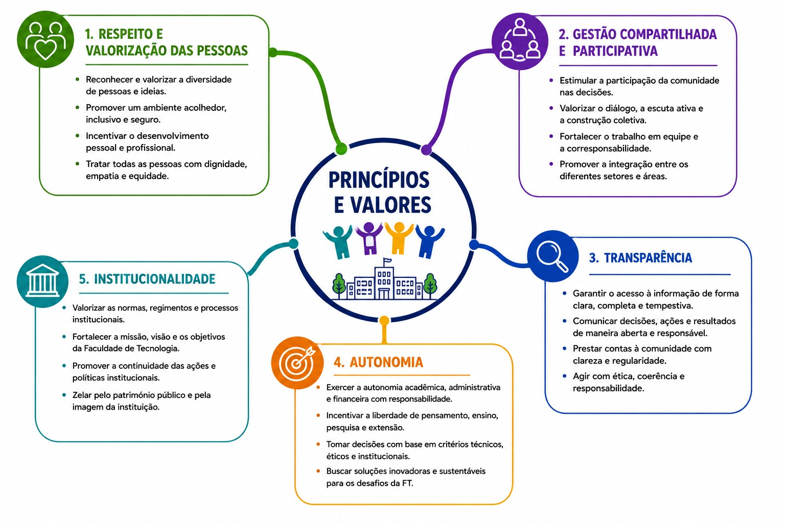

## Experiência para Avançar...

Profa. Carmenlucia Santos Giordano Penteado e Prof. Vitor R. Coluci

Em 2029, a Faculdade de Tecnologia (FT) celebrará duas décadas de uma trajetória marcada por crescimento, inovação e excelência acadêmica. Desde a sua criação, com a transformação do Centro Superior de Educação Tecnológica (CESET) em uma Unidade de Ensino, Pesquisa e Extensão da UNICAMP, a FT consolidou-se como uma instituição de referência, ampliando de forma significativa suas atividades e seu quadro de funcionários.

Ao longo desses anos, foram criados novos cursos de graduação, foi implantado o Programa de Pós-Graduação e a Coordenação de Pesquisa, levando a aumentos expressivos na produção científica e captação de recursos para pesquisa, bem como à expansão das atividades de extensão. Esses avanços são resultado do empenho e da dedicação de docentes, funcionários técnico administrativos e estudantes, aliados ao trabalho de gestões comprometidas com o desenvolvimento institucional.

Na FT de hoje, nós, *Carmen* e *Vitor*, unimos nossos esforços, nossa maturidade e nossas experiências para dar continuidade ao trabalho construído por aqueles que nos antecederam, e para projetar os próximos passos de nossa Faculdade. Desde nosso ingresso na Unicamp, temos participado ativamente, em diferentes momentos, da gestão institucional, acumulando experiências em todas as áreas: Carmen, como *Coordenadora de Extensão* e de *Graduação* e *Diretora Associada*; e Vitor, como *Coordenador de Pesquisa* e *Pós-Graduação*. Essa trajetória nos permitiu conhecer de perto os desafios, as conquistas e as potencialidades da FT, e nos prepara para assumir, com responsabilidade e entusiasmo, o compromisso de conduzir a Faculdade nos próximos anos.

_``Essa candidatura nasce da união de nossas experiências em gestão na FT e do sonho de construir, juntos, uma faculdade cada vez mais integrada, participativa e comprometida com a eficiência e a excelência no ensino, na pesquisa, na extensão e na gestão institucional. Uma faculdade que tenha, como alicerces fundamentais, o respeito, a valorização das pessoas e o reconhecimento de que são elas que constroem, todos os dias, a nossa instituição.''_

Nossa proposta é exercer, na Direção da FT, uma gestão com Princípios e Valores (Figura 1) apoiados no diálogo, na colaboração e no planejamento, atuando como facilitadores dos processos institucionais e criando as condições necessárias para que docentes e servidores técnico-administrativos possam desempenhar suas atividades com autonomia, eficiência e excelência. 

::: {.centerText}
{width=80%}
:::

Entendemos que uma gestão eficaz deve apoiar as pessoas, remover obstáculos e promover um ambiente favorável ao ensino, à pesquisa, à extensão e à inovação.

Apresentamos neste documento, nossa candidatura e nosso Plano de Gestão, que representa, mais do que um conjunto de propostas, um ponto de partida para uma *construção coletiva*. Esperamos que ele seja *continuamente* enriquecido pela comunidade da FT, por meio de novas ideias, sugestões e iniciativas que contribuam para tornar nossa Faculdade cada vez mais forte, inovadora e reconhecida.

## Nossa Visão da Gestão Institucional

A FT alcançou, ao longo de sua existência, importantes conquistas que refletem o compromisso de sua comunidade com a excelência no ensino, pesquisa e extensão. O seu crescimento, a consolidação de seus cursos de graduação e de pós-graduação, o fortalecimento da produção científica e a ampliação de sua inserção junto à sociedade são resultados do trabalho coletivo e diário de docentes, pesquisadores, servidores técnico-administrativos e estudantes.

Os próximos anos trazem novos desafios e, ao mesmo tempo, grandes oportunidades. As rápidas transformações tecnológicas, as mudanças no perfil dos estudantes, a necessidade de ampliar a internacionalização, fortalecer a interdisciplinaridade, promover ambientes cada vez mais inclusivos e consolidar uma gestão eficiente exigem planejamento, diálogo permanente e capacidade de inovação. 

_``Mais do que responder a esses desafios, é necessário construir, de forma compartilhada, uma visão de futuro para a nossa Faculdade.''_

Este Plano de Gestão nasce desse compromisso. Fundamenta-se na convicção de que uma gestão participativa, transparente, acolhedora e baseada no respeito às pessoas é capaz de potencializar talentos, fortalecer relações de confiança e criar as condições necessárias para que toda a comunidade acadêmica desenvolva plenamente suas atividades. Acreditamos que as melhores soluções surgem da escuta ativa, do trabalho colaborativo e da valorização das diferentes experiências e perspectivas que compõem a nossa Unidade.

As propostas aqui apresentadas estão organizadas em Eixos Estratégicos (Figura 2) que abrangem comunicação institucional, gestão de pessoas, direitos humanos, graduação, pós-graduação, pesquisa, extensão e infraestrutura. 

Esses eixos representam um compromisso com a construção de uma Faculdade cada vez mais integrada, inovadora, inclusiva e socialmente comprometida, fortalecendo sua identidade institucional e ampliando seu protagonismo dentro da UNICAMP e perante a sociedade. 

_``A criação da proposta com base nesses eixos foi pensada para suprir, em parte, necessidades de melhoria apontadas na última avaliação interna.''_

Convidamos toda a comunidade da FT a participar dessa construção coletiva. Com diálogo, responsabilidade, respeito e espírito colaborativo, queremos consolidar uma gestão que valorize as pessoas, incentive a excelência acadêmica e administrativa, e prepare a nossa Faculdade para enfrentar os desafios do presente e do futuro, preservando seu compromisso com a formação de profissionais, com a produção de conhecimento e com a transformação da sociedade.