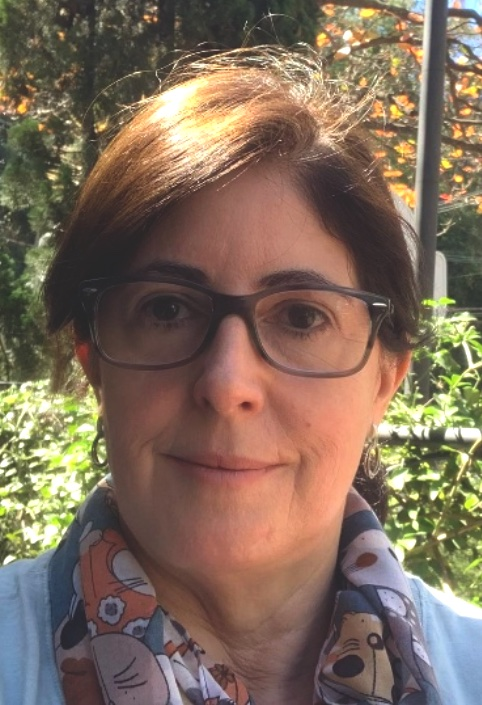
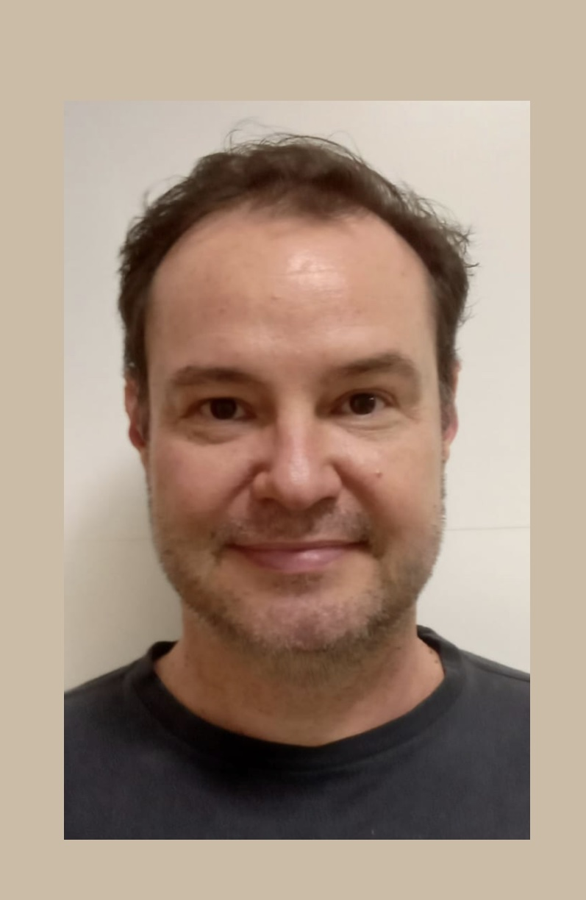

## [Profa. Carmenlucia Santos Giordano Penteado](http://lattes.cnpq.br/6694143241761752)

::: {.centerText}
{width=30%}
:::

Sou engenheira química formada pela Universidade Federal do Paraná (UFPR), mestre em Engenharia Química pela Universidade Federal de São Carlos (UFSCar) e doutora em Ciências da Engenharia Ambiental pela Universidade de São Paulo (USP), com período de doutorado sanduíche na University of Nebraska–Lincoln (UNL), nos Estados Unidos.

Atualmente, sou *Professora Livre-Docente*, e atuo na graduação e na pós-graduação da FT, ministrando disciplinas nas áreas de Produção Mais Limpa e Gerenciamento de Resíduos Sólidos. Minha trajetória acadêmica é pautada pela integração entre ensino, pesquisa, extensão e gestão universitária, com atuação em pesquisas na área de gestão e gerenciamento de resíduos sólidos.

Exerci a função de *Coordenadora de Extensão* entre 2009 e 2010, participei de três operações do Projeto Rondon e desenvolvi diversas ações extensionistas, reconhecidas com o *Prêmio PROEC de Extensão Universitária* em 2023. Neste mesmo ano, fui homenageada pela Prefeitura Municipal de Campinas, com o *Diploma de Mérito Socioambiental “Paulo Nogueira Neto”*, em reconhecimento à minha contribuição para as questões socioambientais, no âmbito da Semana Municipal do Meio Ambiente. 

No ensino, recebi o *Prêmio de Reconhecimento Docente pela Dedicação ao Ensino de Graduação* em 2021, distinção que representa o compromisso permanente com a formação de qualidade de nossos estudantes.

Minha experiência em gestão acadêmica iniciou-se na *Coordenação de Graduação*, entre 2011 e 2013, período em que me dediquei profundamente na *criação do Curso de Engenharia Ambiental*, tendo sido sua primeira coordenadora. Posteriormente, coordenei novamente esse curso, entre 2015 e 2018, conduzindo etapas importantes de sua consolidação, incluindo o reconhecimento junto ao Conselho Estadual de Educação.

Desde 2023, exerço a função de *Diretora Associada* da FT, participando ativamente da administração da Unidade e de diferentes comissões e órgãos colegiados da Faculdade e da Universidade. Essa vivência ampliou minha compreensão dos desafios institucionais, fortaleceu minha capacidade de gestão e proporcionou uma visão integrada das diferentes dimensões que sustentam uma universidade pública de excelência.

Essa trajetória, construída ao longo de anos de dedicação à UNICAMP e à Faculdade de Tecnologia, permitiu conhecer de perto as potencialidades da nossa Unidade, bem como os desafios que ainda precisam ser enfrentados. Também reforçou a convicção de que a construção de soluções duradouras depende do diálogo permanente, da participação da comunidade, do planejamento e da gestão compartilhada.

## [Prof. Vitor R. Coluci](https://vitorcoluci.github.io/homepage-vitor/)

::: {.centerText}
{width=30%}
:::

Sou físico formado pela UNICAMP, realizei meu mestrado e doutorado também na UNICAMP, com estágio na Universidade do Texas/Dallas--EUA. Sou professor titular da UNICAMP e, na FT, leciono disciplinas de graduação nas áreas de Física e Matemática e de Escrita Acadêmica na pós-graduação. Trabalho com pesquisa na área de [simulações computacionais de nanomateriais baseados em carbono](https://youtu.be/Rc8abBkuWtU) e na área de Ensino de Física. 

Coordeno o [Laboratório de Simulação e Computação de Alto Desempenho](https://cluster.ft.unicamp.br) onde se encontra um dos equipamentos multi-usuários da FT.  Coordeno ainda o [Explora](https://explora.ft.unicamp.br/), um espaço de ensino, pesquisa e extensão. Concebi e organizei os  [Workshops de Práticas de Ensino da FT](https://wordpress.ft.unicamp.br/workshopensino/), com o objetivo de fomentar melhorias no Ensino. Em 2019, recebi o Prêmio de Reconhecimento Docente pela Dedicação ao Ensino de Graduação. Em 2025 e 2026 idealizei e presidi a Comissão da [FT de Portas Abertas](https://vitorcoluci.github.io/ftpa/), em um esforço conjunto com a Direção e Coordenações de Cursos, para ampliar a divulgação dos nossos cursos para estudantes de Limeira e região. 

Na Pós-graduação, entre 2013 e 2015, atuei como [Coordenador do PPGT](https://wordpress.ft.unicamp.br/vitor/wp-content/uploads/sites/30/2019/06/relatorio-gestao-vitor-2013-2015.pdf). Nesse período, contribuí para a criação e implementação do Programa de Doutorado (2014) e para a elevação da nota da Capes do Programa de 3 para 4. Idealizei e coordenei a implantação do [sistema de gerenciamento da pós-graduação (SGPG)](https://sistemas.ft.unicamp.br/sgpg/login.php), que é usado até hoje nos processos seletivos e acompanhamento de bolsistas CAPES e que foi expandido para a graduação e usado na submissão dos planos de ensino pelos docentes. Um outro sistema implantado na época foi o Programa de Avaliação da Pós-graduação (PAPG), voltado para a avaliação das disciplinas de pós-graduação. Ainda como coordenador de pós-graduação, reestruturei a página web do PPGT com a estrutura que foi mantida até hoje. Recentemente, participei também da Comissão de Auto-avaliação do PPGT, o que gerou um [relatório detalhado](https://www.ft.unicamp.br/sites/default/files/relatorio_autoavaliacao_ppgt_0.pdf) sobre o Programa. 

De 2010 a 2013 fui *coordenador de Pesquisa*, atuando como presidente da recém implementada Comissão de Pesquisa da FT. Ações tomadas na época envolveram o oferecimento de *cursos de escrita científica a docentes e alunos*, assessoria aos docentes na elaboração de projetos de pesquisa, assessoria no gerenciamento de reserva técnica de auxílios e organização de seminários/colóquios de pesquisa de pesquisadores externos à Unidade. Represento atualmente a FT no Conselho de Orientação FAEPEX e sou membro da Comissão de Pesquisa da FT. 

Na Extensão, tenho trabalhado em alguns projetos, dentre eles o [projeto IDEIA](https://www.youtube.com/watch?v=TmjUGAk4E48) voltado para crianças com altas habilidades e o [projeto Musicalizando](https://youtu.be/fwiytFiYVE8) voltado para a população 50+. Tenho participado de várias comissões administrativas, como a da avaliação de disciplinas, da implementação do novo curso de Ciência de Dados e Inteligência Artificial, do núcleo docente estruturante da área de Computação e do Comitê Local para a Gestão de Privacidade e Proteção de Dados Pessoais. Um pouco mais sobre minha trajetória profissional pode ser visto na [entrevista](https://www.youtube.com/watch?v=Ho2Xfxk-g9g) feita por Thiago Feitosa do Prisma Cast.